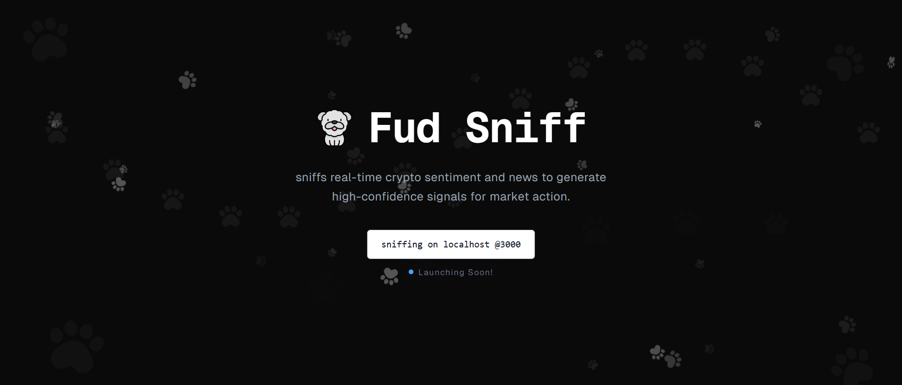

#  Fud Sniff

Fud Sniff is a trading signal agent that sniffs real-time crypto sentiment and news to generate high-confidence signals for market action.



## Project Structure

```
fudsniff/
├── backend/              # Server-side application logic & services
│   └── superior-agents/  # Core backend engine - Powered by Superior Agents
├── frontend/             # Next.js + Tailwind for UI and dashboards
└── setup.sh              # One-click local setup script
```

## How to Setup

Clone the repository and run the setup script:

```bash
git clone https://github.com/adisuyash/fudsniff.git
cd fudsniff
chmod +x setup.sh
./setup.sh
```

This will:

- Install frontend dependencies using npm
- Set up a Python virtual environment in the backend
- Install backend dependencies from `requirements.txt`

> Note: Ensure Python and Node.js are installed on your system.

## Environment Variables

Create a `.env` file inside the `backend/` directory with the following:

```
# Google Gemini API Key
GEMINI_API_KEY=your_api_key

# CoinGecko API Key
COINGECKO_API_KEY=your_api_key

# Telegram Bot Token
TELEGRAM_BOT_TOKEN=your_bot_token

# News API Key (optional)
NEWS_API_KEY=your_newsapi_key_here

# Flask Configuration
FLASK_ENV=development
FLASK_PORT=5000
```

## Scripts

```bash
./setup.sh    # Installs frontend and backend dependencies
```

---

## Local Development

- Frontend: [localhost:3000](http://localhost:3000)
- Backend: [localhost:5000](http://localhost:5000)

Make sure to add your API keys in `backend/.env` before running the app.

## Additional Info

Built by [AdiSuyash](https://x.com/adisuyash) ⚡ • Powered by [Superior Agents](https://superioragents.com) 💛
